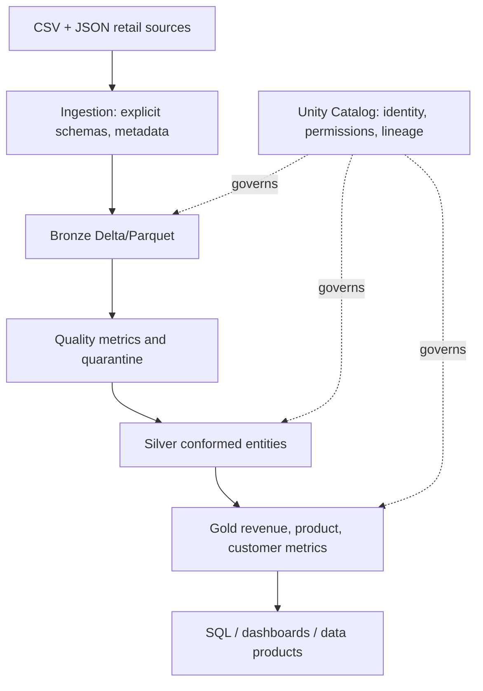

# RetailFlow architecture

```mermaid
flowchart TB
  R[CSV + JSON retail sources] --> I[Ingestion: explicit schemas, metadata]
  I --> B[Bronze Delta/Parquet]
  B --> D[Quality metrics and quarantine]
  D --> S[Silver conformed entities]
  S --> G[Gold revenue, product, customer metrics]
  G --> BI[SQL / dashboards / data products]
  UC[Unity Catalog: identity, permissions, lineage] -. governs .-> B
  UC -. governs .-> S
  UC -. governs .-> G
```

Locally, the same pipeline writes Parquet. In Databricks, approved Unity Catalog storage and Delta tables are the production target.
